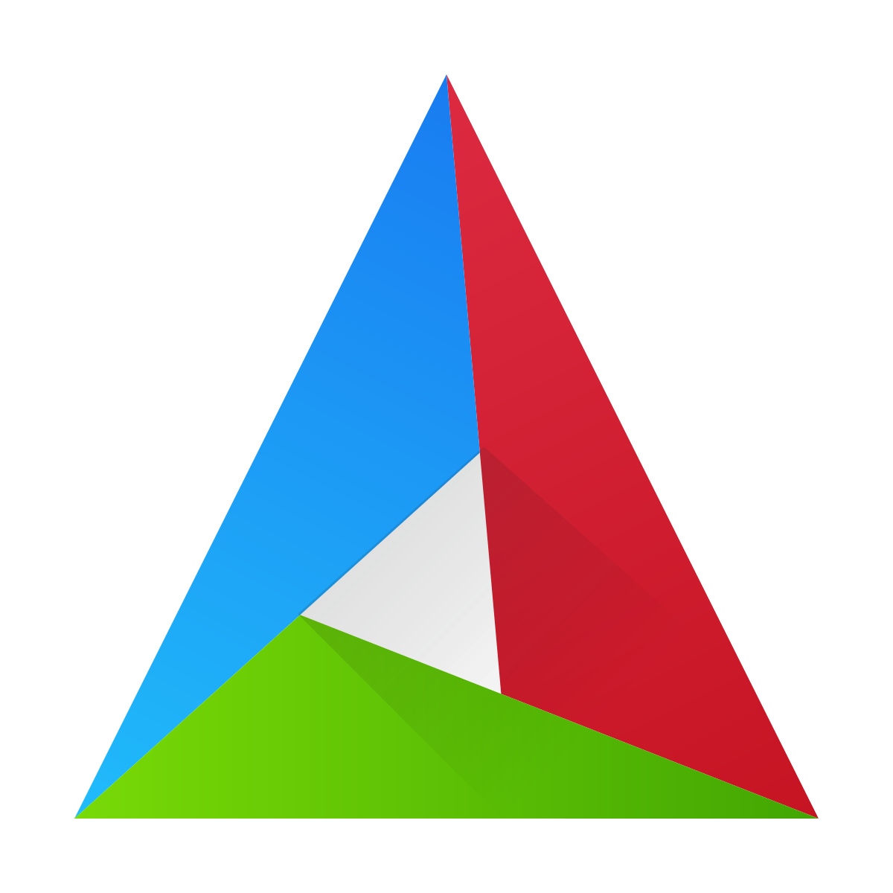
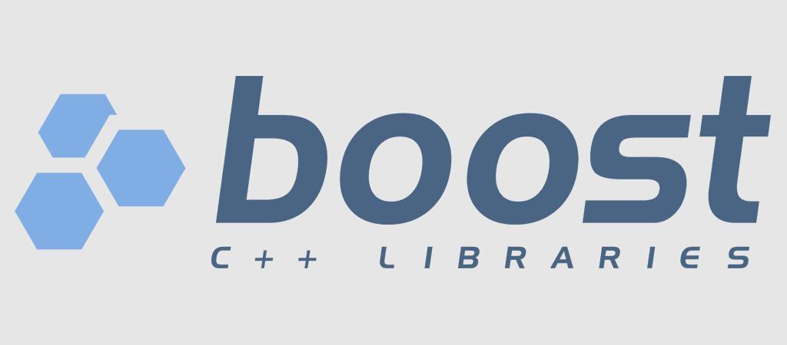

**Contacts**
- <code></code>
- [Telegram](https://t.me/NoHaxEx)
- [Instagram](https://www.instagram.com/sahil_is_baku/)
---
**Languages and Tools:**
  <code></code>
  <code></code>
  <code></code>
  <code></code>
  <code></code>
---

